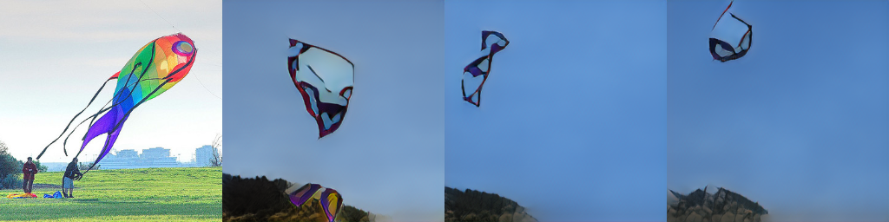
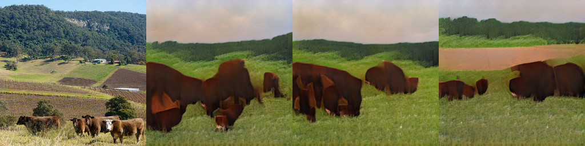

# TelephoneGAN

TelephoneGAN is a framework for generating semantically-related images from a base input image, essentially by conditioning an AttnGAN model on the output of an image captioning model.





## Introduction

Semantically-related images are ones that, visually, do not necessarily have the same overall appearance - but whose contents are still very similar to one another. For instance, two photos of a brown bear might look very different - one could show a forest with the bear somewhere in the midground (a mostly green photo), and the other could show a closeup of the bear (a mostly brown photo). We can search for semantically-related images in a database if the images are *indexed*. We can also use GANs to generate *visually similar* images from scratch. Here, we'll combine these ideas to *generate semantically-related images from scratch*.


To do this, we can use a [CNN-LSTM model](https://github.com/yunjey/pytorch-tutorial/tree/master/tutorials/03-advanced/image_captioning) to produce an image caption for our base image, then write that caption to a file that is subsequently used as input for an [AttnGAN model](https://github.com/taoxugit/AttnGAN) for text-to-image synthesis. The result is a purely computer-generated image with the same semantic meaning as the original, even though it may look quite different! We'll use models pre-trained on the MS COCO dataset to demonstrate.

Note that GAN image generation is as yet far from perfect (although it is improving all the time), and that the COCO dataset is a particularly challenging one. *Broken Telephone* is a popular children's game where a message's meaning becomes garbled as it is passed on, with errors accumulating over time. As the pictures generated by the GAN will inevitably undergo a similar effect, it will also be worthwhile to investigate the behaviour when this process is repeated indefinitely using the new output as the base image. The results are somewhat surprising!

## Run the project

### 1. Clone the repository and install dependencies

Running this project requires Python 2.7 and PyTorch on a CUDA-capable device. Using a virtual machine like [Google Colab](https://colab.research.google.com/notebooks/welcome.ipynb) is recommended.

To get started, clone the repository and also install the required modules:

```bash
git clone https://github.com/anthonyftwang/TelephoneGAN.git
cd TelephoneGAN
pip install -r requirements.txt
```

You'll also need to download the pre-trained models:

#### Image Captioning

- [Pre-trained model](https://www.dropbox.com/s/ne0ixz5d58ccbbz/pretrained_model.zip). Extract the two files to `/models/` **and rename them to `decoder-2-1000.ckpt` and `encoder-2-1000.ckpt`, respectively**

#### AttnGAN

- [Pre-trained model](https://drive.google.com/file/d/1i9Xkg9nU74RAvkcqKE-rJYhjvzKAMnCi/view). Extract `coco_AttnGAN2.pth` to `/models/`
- [DAMSM encoder](https://drive.google.com/file/d/1zIrXCE9F6yfbEJIbNP5-YrEe2pZcPSGJ/view). Extract the `coco` directory to `/DAMSMencoders/`

### 2. Generate images

You can add base images (choose from the [COCO dataset](http://cocodataset.org/#download), e.g. 2014 Test) to the `/input/` directory. Now allow permissions and run the bash script to generate the images! Don't forget to include your base image as an argument.

```bash
chmod +x run.sh
./run.sh input/example1.jpg
```

The caption will be printed to the screen, and the resulting images will be available in `/models/coco_AttnGAN2/example_captions/`.

### 3. Broken telephone

To investigate what happens when the process is repeated, run

```bash
./run.sh models/coco_AttnGAN2/example_captions/0_s_0_g2.png
```

Note this should overwrite the other images in `/models/coco_AttnGAN2/example_captions/`.

## Examples

In these graphics each image is generated using the one to its left as the base. Interestingly, when the quality of the image degrades the caption more or less remains true to the meaning of the original image! The result is an impressive overall stability in the image quality after the initial drop-off. These results could also be helpful in trying to understand what cues the model is taking in order to determine the caption.


*These are all "baseball players swinging a bat".*


*This bear went from brown to black!*


*These kites are pretty convincing.*


*This example is particularly stable.*


*A "person" showed up in the fourth image here. (What attribute of the third one might have caused this?)*


*In this case the image quality actually improved as the caption happened to change slightly!*

## Troubleshooting & extras

If not using Google Colab, change the line

```python
fnt = ImageFont.truetype('/usr/share/fonts/truetype/liberation/LiberationMono-Regular.ttf', 50)
```

in `/code/miscc/utils.py` to specify the local font path.

You can also change the number of images produced each time (default 16) by modifying the value in the method `gen_example()` in `/code/trainer.py`.
